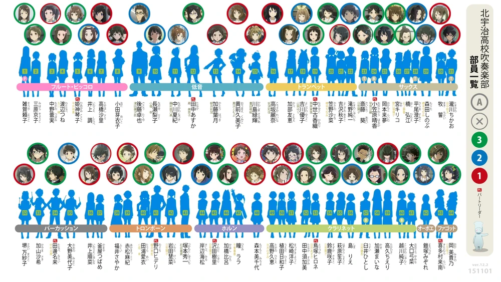
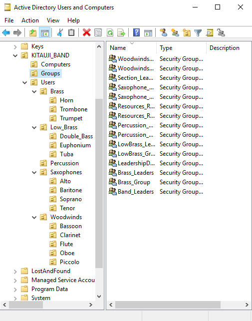
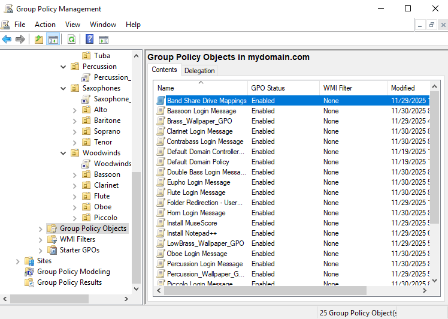

# Kitauji High Concert Band Active Directory Lab Project

## 1. Project Overview

This project is basically a home lab designed to simulate the setup and management of a small organization's Active Directory environment. In this project I RP as an IT admin the Kitauji High School Concert Band club from the Japanese animated series *Sound! Euphonium*.

The goals of this project were to practice AD concepts like organizational units, security groups, group policies, shared folders, and software deployment in a virtual environment.

### Project Scenario

The Kitauji High Concert Band club has recently decided to move parts of their music workflow to a digital medium. The students in the club require easy access to software like Muse Score for music sheet annotations and collaborative editing. They also need secure folders to share resources in their different band sections.To efficiently manage this, the band has hired an IT adminitrator (me) to set up an Active Directory environment and handle user accounts, permissions and group policies for band members and leadership.

---

*Figure 1.1 - Kitauji High Concert Band members*

---
## 2. Home Lab Environment Setup

The lab environment consists of two virtual machines running on VirtualBox:  

- **Server VM:** Windows Server 2019  
  - Installed roles and features:  
    - **Active Directory Domain Services (AD DS)** – manages users, organizational units, and groups.  
    - **DHCP** – automatically assigns IP addresses to client machines.  
    - **RAS/NAT** – provides internet access to the internal network.  

- **Client VM:** Windows 10  
  - Joins the Active Directory domain hosted on the server VM.  
  - Used to test user logins, group policies, and shared folder access.

The VMs are connected via an **internal network adapter** for isolated communication, with the server providing NAT for internet access.

# 3. IT Admin Setup

This section describes how users and security groups where organised within Active Directory to manage permissions and resources. Powershell Scripting was used to create the user accounts and sort them into Security Groups.

## Organisational Units (OUs)

- **Users OU:** Contains all individual user accounts, subdivided by instrument/section:
  - Brass (with sub-OUs: Horn, Trombone and Trumpet)
  - Low_Brass (with sub-OUs: Euphonium, Tuba, Double_Bass)
  - Percussion (no sub-OUs)
  - Saxophones (with sub-OUs: Alto, Baritone, Soprano, Tenor)
  - Woodwinds (with sub-OUs: Bassoon, Clarient, Flute, Oboe, Piccolo)

## Security Groups

- **Band_Leaders:** Users with the highest privileges, able to modify shared resources and oversee band operations.  
- **Section_Leaders:** Users who can manage their instrument section’s resources.  
- **Instrument Section Groups:** Brass_Group, LowBrass_Group, Percussion_Group, Woodwinds_Group, Saxophone_Group; these help assign shared folder permissions.  
- **Resource Groups:** Resources_ReadOnly, Resources_ReadWrite; control access levels for shared folders.

---

*Figure 3.1 - OU structure and Security groups in Active Directory*

---

## 4. Group Policy Objects (GPOs)

This section goes over the Group Policy Objects (GPOs) implemented for the Kitauji High Band Active Directory lab. The main GPOs implemented in this project include:

- **Drive Mapping:** Automatically map shared network folders to users’ computers based on their roles and section memberships.
- **Folder Redirection:** Redirect users’ Desktop and Documents folders to the server so that files follow them across different computers.
- **Software Deployment:** Install necessary applications such as MuseScore automatically for users or computers.
- **Section-specific Backgrounds:** Customize desktop backgrounds for users depending on their instrument section.
- **Login Message Notifications:** Display a pop-up message upon login to convey important information to users.

---

 

*Figure 4.1 - GPO Policy Objects*

---

