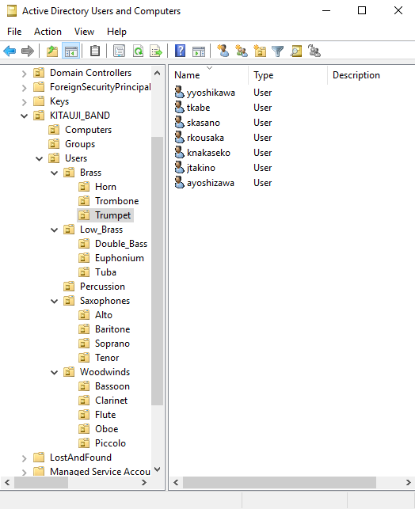

# Kitauji High Concert Band Active Directory Lab Project

## 1. Project Overview

This project is basically a home lab designed to simulate the setup and management of a small organization's Active Directory environment. In this project I RP as an IT admin the Kitauji High School Concert Band club from the Japanese animated series *Sound! Euphonium*.

The goals of this project were to practice AD concepts like organizational units, security groups, group policies, shared folders, and software deployment in a virtual environment.

### Project Scenario

The Kitauji High Concert Band club has recently decided to move parts of their music workflow to a digital medium. The students in the club require easy access to software like Muse Score for music sheet annotations and collaborative editing. They also need secure folders to share resources in their different band sections.To efficiently manage this, the band has hired an IT adminitrator (me) to set up an Active Directory environment and handle user accounts, permissions and group policies for band members and leadership.

*Figure 1.1 - Kitauji High Concert Band members*

## 2. Home Lab Environment Setup

The lab environment consists of two virtual machines running on VirtualBox:  

- **Server VM:** Windows Server 2019  
  - Installed roles and features:  
    - **Active Directory Domain Services (AD DS)** – manages users, organizational units, and groups.  
    - **DHCP** – automatically assigns IP addresses to client machines.  
    - **RAS/NAT** – provides internet access to the internal network.  

- **Client VM:** Windows 10  
  - Joins the Active Directory domain hosted on the server VM.  
  - Used to test user logins, group policies, and shared folder access.

The VMs are connected via an **internal network adapter** for isolated communication, with the server providing NAT for internet access.

# 3. IT Admin Setup

In this section, we describe how the IT administrator organized the users and security groups within Active Directory to manage permissions and resources efficiently.

## Organisational Units (OUs)

The Active Directory users were organized into OUs based on their instrument sections. This logical separation helps reflect the structure of the band and simplifies management.

- **Users OU:** Contains all individual user accounts, subdivided by instrument/section:
  - Brass
  - Low_Brass (with sub-OUs: Euphonium, Tuba, Double_Bass)
  - Percussion
  - Saxophones
  - Woodwinds

Organizing users into sections allows the IT admin to apply policies, permissions, and shared folder access based on instrument groups.

## Security Groups

Security groups were created to manage access and roles:

- **Band_Leaders:** Users with the highest privileges, able to modify shared resources and oversee band operations.  
- **Section_Leaders:** Users who can manage their instrument section’s resources.  
- **Instrument Section Groups:** Brass_Group, LowBrass_Group, Percussion_Group, Woodwinds_Group, Saxophone_Group; these help assign shared folder permissions.  
- **Resource Groups:** Resources_ReadOnly, Resources_ReadWrite; control access levels for shared folders.

Security groups allow the IT admin to manage permissions efficiently without having to restructure OUs for leadership roles or resource access.

---

### Figures

<table>
<tr>
<td>

<b>Figure 3.1:</b> OU structure in Active Directory

</td>
<td>

<b>Figure 3.2:</b> Security groups in Active Directory

</td>
</tr>
</table>

